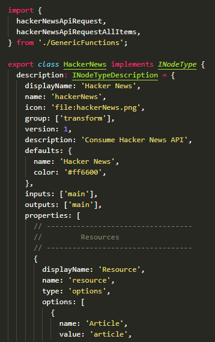
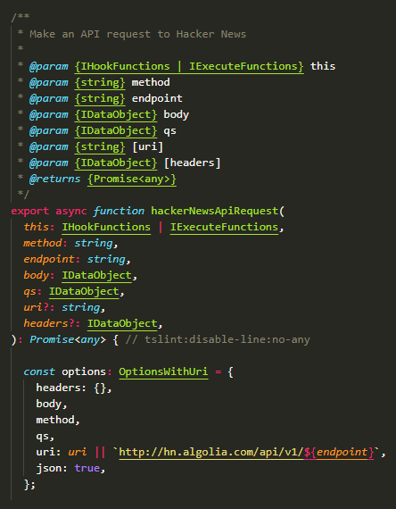
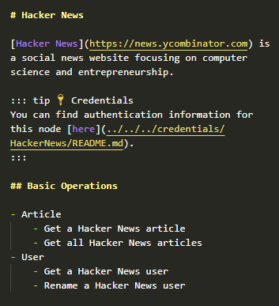
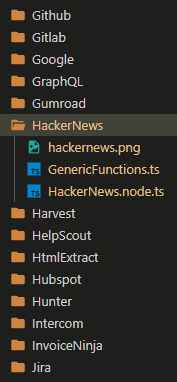
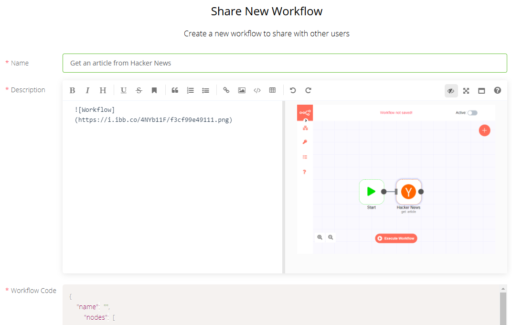

<p align="center">
  
</p>

<p align="center">
  <h1 align="center">Nodemaker</h1>
</p>

<p align="center">
  Desktop app and CLI utility to auto-generate n8n nodes<br/>
  by <a href='https://github.com/ivov'>Iván Ovejero</a> and <a href='https://github.com/erin2722'>Erin McNulty</a>
</p>

<p align="center">
  <a href="#overview">Overview</a> •
  <a href="/docs/output-examples">Examples</a> •
  <a href="#installation">Installation</a> •
  <a href="#operation">Operation</a> •
  <a href="/docs/cli-reference.md">Documentation</a>
</p>

<p align="center">
  
  <a href="https://github.com/MLH-Fellowship"></a>
  
</p>

<br/>

**Nodemaker** is an automatic node generator for [n8n](https://github.com/n8n-io/n8n), a workflow automation tool. Nodemaker outputs all functionality and documentation files for a node, places them in the official repos, and uploads a sample workflow to [n8n.io](https://n8n.io/workflows).

Developed as a **desktop app** and **CLI utility**, in MVP stage, as a capstone project for the [MLH Fellowship](https://github.com/MLH-Fellowship).

<br/>

<p align="center">
    
    &nbsp;&nbsp;&nbsp;&nbsp;
    
    &nbsp;&nbsp;&nbsp;&nbsp;
    
    &nbsp;&nbsp;&nbsp;&nbsp;
    
</p>

<p align="center">
  Built with <b>TypeScript</b>, <b>Node</b>, <b>Electron</b> and <b>Vue</b>
</p>

## Overview

Nodemaker generates two types of files:

**Node functionality files**

- `*.node.ts` — main logic (regular or trigger node)
- `GenericFunctions.ts` — node helper functions
- `*Description.ts` — separate logic per resource (optional)
- `*.credentials.ts` — node authentication params
- `package.json` — updated node listing
- `*.png` — node icon

|   |
| :------------------------------------------------------------------------------: |
|            Excerpts of `HackerNews.node.ts` and `GenericFunctions.ts`            |

<br />

**Node documentation files**

- `README.md` — main doc file
- `README.md` — credentials doc file
- `workflow.png` — in-app screenshot for main doc file

|   |
| :-------------------------------------------------------------------------------: |
|                  Excerpt of main `README.md` and `workflow.png`                   |

<br />

Once these files are generated, Nodemaker can:

- relocate them in your copies of the [n8n](https://github.com/n8n-io/n8n) and [n8n-docs](https://github.com/n8n-io/n8n-docs) repos, and
- submit a sample workflow to the [n8n.io](https://n8n.io/workflows) collection.

|    |
| :----------------------------------------------------------------------------------------------------------------: |
| Node TypeScript files placed in `n8n` repo and automated workflow submission on [n8n.io](https://n8n.io/workflows) |

## Installation

To install Nodemaker:

```sh
git clone https://github.com/MLH-Fellowship/nodemaker.git
npm i
cd client && npm i
```

To set up the official repos [n8n](https://github.com/n8n-io/n8n) and [n8n-docs](https://github.com/n8n-io/n8n-docs), see [here](/docs/general-reference.md#official-repos).

## Operation

Nodemaker can be operated as a desktop app or as a CLI utility.

### Desktop app

> PENDING: Explanation of how to run and operate desktop app.

**Note:** At MVP stage, `shotgen`, `flowgen`, `icongen` and `resize` are not available through the desktop app.

### CLI utility

1. Enter node params as explained [here](/docs/cli-reference.md#parameters).
2. Run a script: `npm run ...`

| Script     | Action                                                          | Docs                                       |
| ---------- | --------------------------------------------------------------- | ------------------------------------------ |
| `nodegen`  | Generate node functionality files in TypeScript.                | [Section](/docs/cli-reference.md#nodegen)  |
| `docsgen`  | Generate node documentation files in Markdown.                  | [Section](/docs/cli-reference.md#docsgen)  |
| `packgen`  | Generate an updated `package.json` file.                        | [Section](/docs/cli-reference.md#packgen)  |
| `shotgen`  | Generate an in-app PNG screenshot.                              | [Section](/docs/cli-reference.md#shotgen)  |
| `flowgen`  | Submit a sample workflow to [n8n.io](https://n8n.io/workflows). | [Section](/docs/cli-reference.md#flowgen)  |
| `icongen`  | Generate five PNG images as icon candidates.                    | [Section](/docs/cli-reference.md#icongen)  |
| `resize`   | Resize an icon candidate to a 60×60 px file.                    | [Section](/docs/cli-reference.md#icongen)  |
| `place`    | Move files to the `n8n` and `n8n-docs` repos.                   | [Section](/docs/cli-reference.md#place)    |
| `validate` | Validate properties in a params object.                         | [Section](/docs/cli-reference.md#validate) |
| `empty`    | Clear the `/output` directory.                                  | ---                                        |
| `desktop`  | Run the desktop app.                                            | ---                                        |

## Authors

© 2020 Iván Ovejero and Erin McNulty

## License

Distributed under the MIT License. See [LICENSE.md](LICENSE.md)
