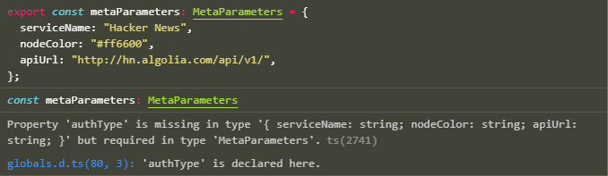
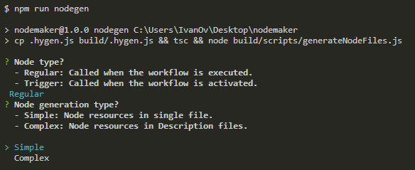
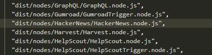
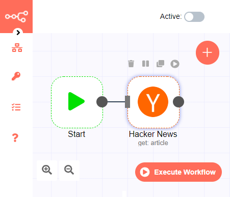
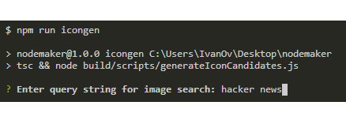
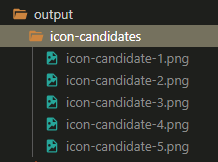
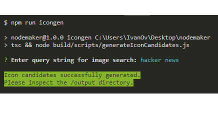
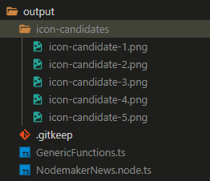
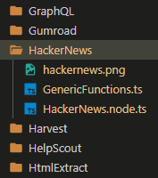
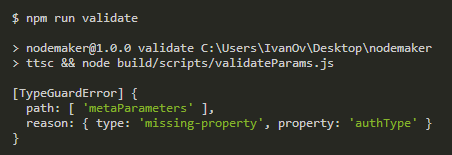

<p align="center">
  
</p>

<p align="center">
  <h2 align="center">CLI Reference</h2>
</p>

<p align="center">
  Learn how to operate the Nodemaker's CLI utility
</p>

<br>

**Table of Contents**

- [Overview](#overview)
- [Parameters](#parameters)
  - [`metaParameters`](#metaparameters)
  - [`regularNodeParameters` or `triggerNodeParameters`](#regularnodeparameters-or-triggernodeparameters)
  - [`docsParameters`](#docsparameters)
  - [Validating params](#validating-params)
- [Commands](#commands)
  - [`nodegen`](#nodegen)
  - [`docsgen`](#docsgen)
  - [`packgen`](#packgen)
  - [`shotgen`](#shotgen)
  - [`flowgen`](#flowgen)
  - [`icongen`](#icongen)
  - [`resize`](#resize)
  - [`place`](#place)
  - [`validate`](#validate)

## Overview

To use the CLI utility:

1. Enter node params as explained [below](#parameters).
2. Run a command: `npm run ...`

| Command    | Action                                                          | Docs                 |
| ---------- | --------------------------------------------------------------- | -------------------- |
| `nodegen`  | Generate node functionality files in TypeScript.                | [Section](#nodegen)  |
| `docsgen`  | Generate node documentation files in Markdown.                  | [Section](#docsgen)  |
| `packgen`  | Generate an updated `package.json` file.                        | [Section](#packgen)  |
| `shotgen`  | Generate an in-app PNG screenshot.                              | [Section](#shotgen)  |
| `flowgen`  | Submit a sample workflow to [n8n.io](https://n8n.io/workflows). | [Section](#flowgen)  |
| `icongen`  | Generate five PNG images as icon candidates.                    | [Section](#icongen)  |
| `resize`   | Resize an icon candidate to a 60×60 px file.                    | [Section](#icongen)  |
| `place`    | Move files to the `n8n` and `n8n-docs` repos.                   | [Section](#place)    |
| `validate` | Validate properties in a params object.                         | [Section](#validate) |
| `empty`    | Clear the `/output` directory.                                  | ---                  |
| `desktop`  | Run the desktop app.                                            | ---                  |

**Note:** At MVP stage, `shotgen`, `flowgen`, `icongen` and `resize` are not available through the desktop app.

<br>

## Parameters

Parameters are the input data needed for generating output files in TypeScript, Markdown, JSON, etc.

Nodemaker reads parameters from `parameters.ts` and generates output files in `/output`.

There are three types of parameters:

- `metaParameters`,
- `regularNodeParameters` (or `triggerNodeParameters`), and
- `docsParameters`.

To enter parameters for generating a node, edit the keys and values in these three objects.

### `metaParameters`

General properties related to the service.

```ts
export const metaParameters: MetaParameters = {
  serviceName: "Hacker News",
  authType: "OAuth2",
  nodeColor: "#ff6600",
  apiUrl: "http://hn.algolia.com/api/v1/",
};
```

Type definition:

```ts
type MetaParameters = {
  serviceName: string;
  authType: AuthType;
  nodeColor: string;
  apiUrl: string;
};
```

For more type information on `MetaParameters`, see [the global type definition](https://github.com/MLH-Fellowship/nodemaker/blob/0e2756722f8b8f262ab3bf65e005c24c97c6ce0a/globals.d.ts).

### `regularNodeParameters` or `triggerNodeParameters`

Specific properties related to the API, for a regular or a trigger node. A **regular node** is called when the workflow is executed; a **trigger node** is called when the workflow is activated.

<details><summary>Example of <code>regularNodeParameters</code></summary>

```ts
export const regularNodeParameters: RegularNodeParameters = {
  Article: [
    {
      name: "Get",
      description: "Get a Hacker News article",
      endpoint: "items/:articleId",
      requestMethod: "GET",
      fields: [
        {
          name: "Article ID",
          description: "The ID of the Hacker News article to be returned",
          type: "string",
          default: "",
        },
        {
          name: "Additional Fields",
          type: "collection",
          default: {},
          options: [
            {
              name: "Include comments",
              type: "boolean",
              default: false,
              description: "Whether to include all the comments in the article",
            },
          ],
        },
      ],
    },
    {
      name: "Get All",
      description: "Get all Hacker News articles",
      endpoint: "search?",
      requestMethod: "GET",
      fields: [
        {
          name: "Return All",
          description: "Whether to return all results or only up to a limit",
          type: "boolean",
          default: false,
        },
        {
          name: "Limit",
          description:
            "Limit of Hacker News articles to be returned for the query",
          type: "number",
          default: 5,
          extraDisplayRestriction: { "Return All": true },
        },
        {
          name: "Additional Fields",
          type: "collection",
          default: {},
          options: [
            {
              name: "Keyword",
              description: "The keyword for filtering the results of the query",
              type: "string",
              default: "",
            },
            {
              name: "Tags",
              description: "Tags for filtering the results of the query",
              type: "multiOptions",
              default: {},
              options: [
                {
                  name: "Story",
                  description: "Returns query results filtered by story tag",
                },
                {
                  name: "Comment",
                  description: "Returns query results filtered by comment tag",
                },
                {
                  name: "Poll",
                  description: "Returns query results filtered by poll tag",
                },
                {
                  name: "Show HN",
                  description: "Returns query results filtered by Show HN tag",
                },
                {
                  name: "Ask HN",
                  description: "Returns query results filtered by Ask HN tag",
                },
                {
                  name: "Front Page",
                  description:
                    "Returns query results filtered by Front Page tag",
                },
              ],
            },
          ],
        },
      ],
    },
  ],
  User: [
    {
      name: "Get",
      description: "Get a Hacker News user",
      endpoint: "users/:username",
      requestMethod: "GET",
      fields: [
        {
          name: "Username",
          description: "The Hacker News user to be returned",
          type: "string",
          default: "",
        },
      ],
    },
    {
      name: "Rename",
      description: "Rename a Hacker News user",
      endpoint: "users/:username",
      requestMethod: "PUT",
      fields: [
        {
          name: "Username",
          description: "The Hacker News user to be renamed",
          type: "string",
          default: "",
        },
      ],
    },
  ],
};
```

</details>
<details><summary>Example of <code>triggerNodeParameters</code></summary>

```ts
export const triggerNodeParameters: TriggerNodeParameters = {
  webhookEndpoint: "/automations/hooks",
  webhookProperties: [
    {
      displayName: "Event",
      name: "event",
      type: "options",
      required: true,
      default: "subscriberActivated",
      description:
        "The events that can trigger the webhook and whether they are enabled.",
      options: [
        {
          name: "Subscriber Activated",
          value: "subscriberActivated",
          description:
            "Whether the webhook is triggered when a subscriber is activated.",
        },
        {
          name: "Link Clicked",
          value: "linkClicked",
          description:
            "Whether the webhook is triggered when a link is clicked.",
          fields: [
            {
              displayName: "Initiating Link",
              name: "link",
              type: "string",
              required: true,
              default: "",
              description: "The URL of the initiating link",
            },
          ],
        },
      ],
    },
  ],
};
```

</details>

**Route parameter**

In `regularNodeParameters`, an operation's `endpoint` property may contain a route parameter, signalled by a colon `:`. The parameter references one of the (camelCased) names of the fields in the operation.

`regularNodeParameters` with an endpoint with a route parameter:

```ts
  Article: [
    {
      name: "Get",
      description: "Get a Hacker News article",
      endpoint: "items/:articleId", // route parameter referencing camelCased name of field
      requestMethod: "GET",
      fields: [
        {
          name: "Article ID",
          description: "The ID of the Hacker News article to be returned",
          type: "string",
          default: "",
        },
	      // ...
```

Output with route parameter in use:

```ts
if (operation === 'get') {

  const articleId = this.getNodeParameter('articleId', i);
  const endpoint = `items/${articleId}`;

  const additionalFields = this.getNodeParameter('additionalFields', i) as IDataObject;
  // TODO: Use additionalFields.fieldName in `qs` or in `body` or as boolean flag

  responseData = await hackerNewsApiRequest.call(this, 'GET', endpoint, body, qs);
```

For more type information on `RegularNodeParameters`, see [the global type definition](https://github.com/MLH-Fellowship/nodemaker/blob/0e2756722f8b8f262ab3bf65e005c24c97c6ce0a/globals.d.ts).

For more type information on `TriggerNodeParameters`, see the global type definition.

Field display restrictions are inferred from the structure of the params object, but if you need an additional field display restriction, add it with `extraDisplayRestriction: { fieldName: boolean }`. See the global type definition.

### `DocsParameters`

Snippets to be used for docs generation.

```ts
export const docsParameters: DocsParameters = {
  serviceName: "Hacker News",
  serviceUrl: "https://news.ycombinator.com",
  introDescription:
    "a social news website focusing on computer science and entrepreneurship",
  exampleUsage: "get an article from Hacker News",
  workflowNumber: "123",
};
```

Type definition:

```ts
type DocsParameters = {
  serviceName: string;
  serviceUrl: string;
  introDescription: string;
  exampleUsage: string;
  workflowNumber: string;
};
```

### Validating params

To validate that your params object conforms to the expected shape, type the object you are editing in `parameters.ts` and look for any TypeScript errors.

<p align="center">
  
</p>

Alternatively, to validate a parameter bundle built on the frontend, use the [`validate` script](#validate).

<br>

## Commands

Output files are all generated in the `/output` dir.

**Coverage**: Output files do not contain 100% of the logic required for the node, because part of that logic always depends on the specific API and often cannot be predicted. The few sections requiring custom logic are pinpointed with `// TODO` comments and `TODO_` variables, together with an explanation of the logic that needs to be added in.

### `nodegen`

```sh
$ npm run nodegen
```

`nodegen` generates:

- `*.node.ts` — main logic (regular or trigger node)
- `GenericFunctions.ts` — node helper functions
- `*Description.ts` — separate logic per resource (optional)
- `*.credentials.ts` — node authentication params

To generate these files, the CLI prompts the user to select:

- whether the node will be:
  - **regular node**, called when the workflow is executed, or
  - **trigger node**, called when the workflow is activated.
- if a regular node, whether the node will be generated
  - in **simple mode**, where the output node has its resources in the main logic file, or
  - in **complex mode**, where the output node has its resources in separate `*Description.ts` files.

If `metaParameters.authType` is set to `"None"`, then no `*.credentials.ts` file will be generated.

<p align="center">
  
</p>

**Note:** Per the [n8n submission guidelines](https://github.com/n8n-io/n8n/blob/master/CONTRIBUTING.md#checklist-before-submitting-a-new-node), this operation auto-sorts all `options` in the node parameters in alphabetical order.

### `docsgen`

> **Important**: `docsgen` is currently only available for regular nodes, not for trigger nodes.

```sh
$ npm run docsgen
```

`docsgen` generates:

- `README.md` — main doc file
- `README.md` — credentials doc file

### `packgen`

```sh
$ npm run packgen
```

`packgen` retrieves a copy of the latest `package.json` file [from the official repo](https://raw.githubusercontent.com/n8n-io/n8n/master/packages/nodes-base/package.json), updates it with the paths to the new node files, and outputs the updated `package.json` file. Path insertion follows alphabetical order.

<p align="center">
  
</p>

**Note:** This operation disallows insertion of a node in the `package.json` if its name already exists in the listing.

### `shotgen`

> **Important:** `shotgen` requires credentials. See below.

```sh
$ npm run shotgen
```

`shotgen` generates a PNG file containing an in-app screenshot of the node, intended for use in the main node documentation file and in the workflow submission to [n8n.io](https://n8n.io/workflows).

To generate the screenshot, `shotgen`:

1. starts the n8n app,
2. runs an automated Chrome instance, and
3. uploads the screenshot to an image hosting service.

For now, the uploaded image URL is simply stored in `image-upload-url.txt`.

`shotgen` requires `n8n` to be built. Refer to [setup instructions for the `n8n` repo](../README.md#main-repos).

There are two ways to run `shotgen`:

- **Separate startup**: Open a terminal, access your local copy of the `n8n` repo and start it with `npm run start`. With the n8n app running, open a second terminal, access the `nodemaker` repo and run `npm run shotgen`.
- **Concurrent startup**: In the `nodemaker` repo, run `npm run runapp-shotgen`. Nodemaker will run two concurrent processes to start the n8n app and generate the screenshot. Concurrent startup functionality is not yet fully tested.

<p align="center">
  
</p>

Concurrent startup requires the `nodemaker` repo to be located alongside your copy of the `n8n` repo.

```sh
.
├── n8n
└── nodemaker
```

**Image upload credentials**

After generating the screenshot, `shotgen` uploads it to the image hosting service [Imgbb](https://imgbb.com/), so that the screenshot can later be used for workflow submission to [n8n.io](https://n8n.io/workflows).

Imgbb requires credentials. To generate them:

1. Visit [Imgbb](https://imgbb.com/).
2. Create an account or sign in with Google, Facebook, etc.
3. While logged in, visit the [Imgbb API docs](https://api.imgbb.com/).
4. Click on `Get API key` and copy your API key.
5. Create an `.env` file in `/config`.
6. Enter your API key as `IMGBB_API_KEY` in the `.env` file.

```sh
IMGBB_API_KEY="6d17c6..."
```

### `flowgen`

> **Important:** `flowgen` requires credentials. See below.

```sh
$ npm run flowgen
```

`flowgen` submits a sample workflow to the [n8n.io](https://n8n.io/workflows) collection. Before running `flowgen`, make sure to first run `shotgen` to generate `workflow.png` and `image-upload-url.txt`.

**Workflow submission credentials**

To log in to [n8n.io](https://n8n.io), `flowgen` needs credentials for a n8n account. Create an account at [n8n.io](https://n8n.io) and enter your credentials as env vars in the `.env` file you created at `/config`:

```sh
N8N_LOGIN_USERNAME="name@example.com"
N8N_LOGIN_PASSWORD="abc123"
```

### `icongen`

> **Important:** `icongen` requires credentials. See below.

```sh
$ npm run icongen
```

`icongen` generates five icon candidates for the node, placing them in `/output/icon-candidates`. To do so, the CLI prompts the user to enter a query string based on which to perform a search for a relevant image. Make sure to search for a specific string that is likely to return a logo image for the service—if the service name happens to be a generic word, add an identifier keyword.

<p align="center">
  
  &nbsp;&nbsp;&nbsp;&nbsp;
  
</p>

**Image search credentials**

`icongen` uses Google's Custom Search Engine, which requires two credentials:

- a Custom Search Engine engine ID, and
- a Google Cloud Platform project API key.

To generate a Custom Search Engine ID:

1. Access the [Custom Search Engine dashboard](https://cse.google.com/cse/create/new).
2. Enter any site in `Sites to Search`, name the engine and `Create`.
3. Click on `Edit search engine` and then on `Setup`.
4. Under `Basics`, copy the string `Search engine ID` and use it for `GOOGLE_IMAGE_SEARCH_ENGINE_ID` in the `.env` file.
5. Under `Basics`, switch on `Image search`.
6. Under `Basics`, switch on `Search the entire web`.
7. Under `Basics`, in `Sites to search`, delete the site you added in step 2.

To generate a Google Cloud Platform project API key:

1. Access the [Google Cloud Platform dashboard](https://console.developers.google.com).
2. On the top-left corner, click on the project name and then on `New Project`.
3. Name the project and `Create`.
4. Select your new project on the top-left corner.
5. Click on `Enable APIs and Services`, search for `Custom Search API`, select it and enable it.
6. Click on `Create Credentials` on the top-right corner, then on `Credentials` on the left nav, then on the `API key` hyperlink, and finally on `Create`. Use the generated API key for `GOOGLE_PROJECT_API_KEY` in the `.env` file.

End result in `/config/.env`:

```sh
GOOGLE_IMAGE_SEARCH_ENGINE_ID="01782..."
GOOGLE_PROJECT_API_KEY="AIzaS..."
```

Google's Custom Search Engine is limited to 100 free requests a day.

### `resize`

```sh
$ npm run resize
```

`resize` converts one of the icon candidates into a 60×60 px PNG file, for use as the final icon for the node. To do so, the CLI prompts the user to inspect the `/output/icon-candidates` dir and select an icon candidate by its number. Before running `resize`, make sure to first run `icongen` to generate the icon candidates.

Per n8n codebase conventions, the output PNG filename is camelCased.

<p align="center">
  
  &nbsp;&nbsp;&nbsp;&nbsp;
  
</p>

### `place`

```sh
$ npm run place
```

`place` relocates node functionality and documentation files in the `/output` dir to their appropriate locations in the `n8n` and `n8n-docs` repos, respectively. To do so, the CLI prompts the user to select the type of file (functionality or documentation) to be relocated.

<p align="center">
  
  &nbsp;&nbsp;&nbsp;&nbsp;
  
</p>

`place` requires the `nodemaker` repo to be located alongside your copies of the `n8n` and `n8n-docs` repos.

```sh
.
├── n8n
├── n8n-docs
└── nodemaker
```

### `validate`

```sh
$ npm run validate
```

`validate` is intended to validate an untyped object, especially to help developers surface errors when troubleshooting why a certain parameter bundle built on the frontend is failing to generate a node.

To validate an untyped object built on the frontend, open [`validateParams.ts`](https://github.com/MLH-Fellowship/nodemaker/blob/master/scripts/validateParams.ts), set the constant `dataToValidate` to the object, choose the appropriate validator method and run `npm run validate`. If validation fails, an error message pinpointing the problem will be shown.

For the available validator methods, see [`Validator.ts`](https://github.com/MLH-Fellowship/nodemaker/blob/master/services/Validator.ts).

<details><summary>Example of <code>validate</code> script</summary>

```ts
import Validator from "../services/Validator";

const dataToValidate = {
  serviceName: "Hacker News",
  nodeColor: "#ff6600",
  apiUrl: "http://hn.algolia.com/api/v1/",
};

const validator = new Validator();

validator.validateMetaParameters(dataToValidate);
```

<p align="center">
  
</p>

</details>
