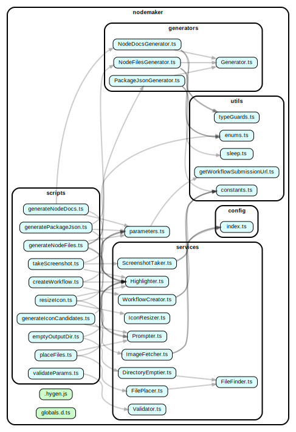
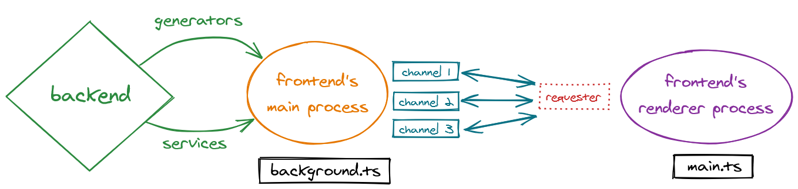
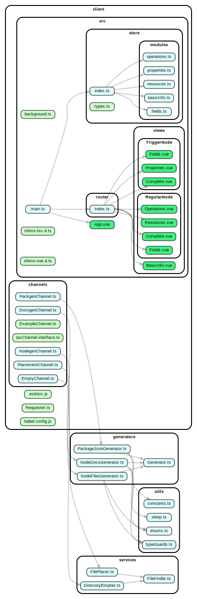

  

  <h2 align="center">Codebase functionality</h2>

  Understand how the Nodemaker's codebase works

 

## Backend

The Nodemaker's backend is a TypeScript/Node app that calls **scripts** that use **generators** and **services**.

**1.** Every CLI command transpiles TypeScript into JavaScript and calls the transpiled version. 
**2.** Each command executes a short script in the `/scripts` directory, which:

- gathers the required parameters (if any),
- instantiates the the required generator or service, and
- runs checks and executes the relevant methods.

**3.** The successful or failed result of the backend operation is simply logged out.

### Generators

Generators are the `Generator` class and its three children `NodeFilesGenerator`, `NodeDocsGenerator` and `PackageJsonGenerator` in the `/generators` directory. All generators rely on [hygen library](https://github.com/jondot/hygen/) to combine the parameters in `parameters.ts` and the EJS templates in `/_templates/gen` to generate output files in `/output`, in TypeScript, Markdown or JSON.

**Note:** While `PackageJsonGenerator` is listed under generators and relies on hygen, this operation is more precisely described, not as generation, as insertion into a `package.json` file, supplied as just another parameter.

### Services

Major operations that do not involve generation with hygen are the services in the `/services` directory:

- `DirectoryEmptier` — to clear out the `/output` directory
- `FilePlacer` — to place output files in the official repos,
- `IconResizer` — to resize the selected icon candidate,
- `ImageFetcher` — to fetch five icon candidates,
- `ScreenshotTaker` — to takke an in-app screenshot,
- `Validator` — to validate an object built on the frontend, and
- `WorkflowCreator` — to submit a workflow on [n8n.io](https://n8n.io/workflows).

The three classes `Prompter` (user input retrieval), `Highlighter` (colored console logging) and `FileFinder` (identification of output files) are auxiliary services, used only indirectly.

### Utilities and configuration

The utilities in `/utils` are various type guards, enums, constants and two functions used throughout the codebase. The global type definition file `globals.d.ts`, although placed at the project's root directory, belongs in this category as well.

The single TypeScript file in `/config` reads the `.env` file to be created there by the user and filled in with their credentials.

 

  <h3 align="center">Backend dependency graph</h3>

  

## Frontend

The Nodemaker's frontend is an Electron/Vue app in `/client`. It uses **channels** for communication between the frontend's renderer process (Vue app in `main.ts`) and its main process (Electron app in `background.ts`).

Firstly, the command `npm run desktop` starts up the Electron app in `client/src/background.ts`, which serves the Vue app rooted in `main.ts` and self-registers all the inter-process communication channels in `client/channels`, namely `NodegenChannel`, `DocsgenChannel`, `PackgenChannel`, `PlacementChannel` and `EmptyChannel`.

  

To communicate with the backend, the Electron app imports and instantiates a class called `Requester` and uses its `request` method like a `fetch` call: `requester.request(channel, argument)` sends out an argument to the backend and returns a `Promise` containing a backend operation result.

The argument is sent out by the frontend's renderer process to its main process through a specific channel. Each channel registered in the Electron app satisfies `Channel.interface.ts`, so it only has a `name` for identification and a `handle` method containing all the logic (provided by the backend) to service the request.

  <h3 align="center">Frontend dependency graph</h3>

  

